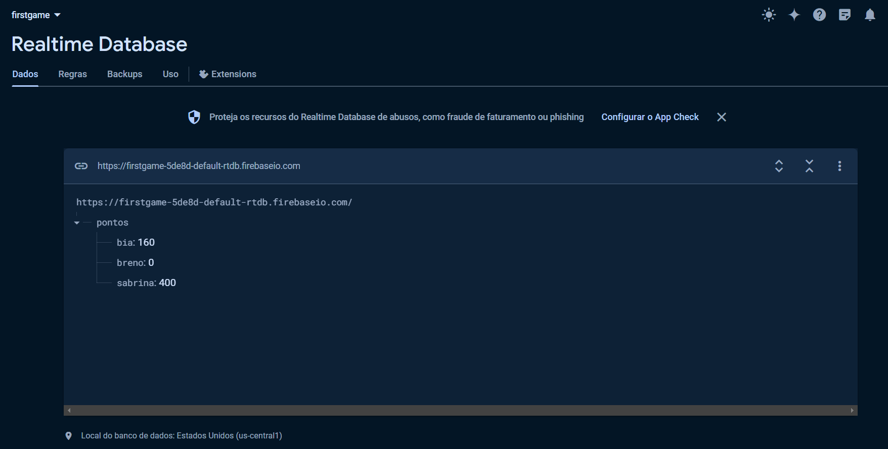
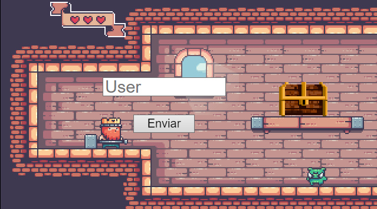
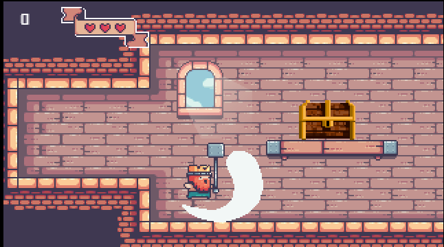
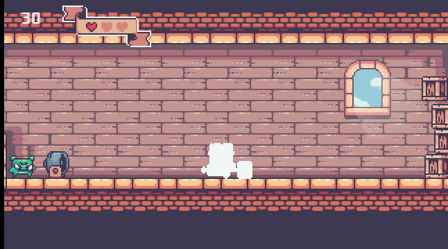

<h1 align="center">
    Derrote os porcos!
</h1>

## Sobre
Um bom rei protege seu povo, esse mini game foi desenvolvido para a disciplina de Introdução à Computação pela plataforma Construct 3. Use as teclas A para ir para a esquerda, D para ir para a direita, W para pular e Space para atacar.

## Ferramentas
- Construct 3
- Firebase

    

    

    

    

## Link do jogo
Acesse ![https://minigameintro.netlify.app] e se divirta!
